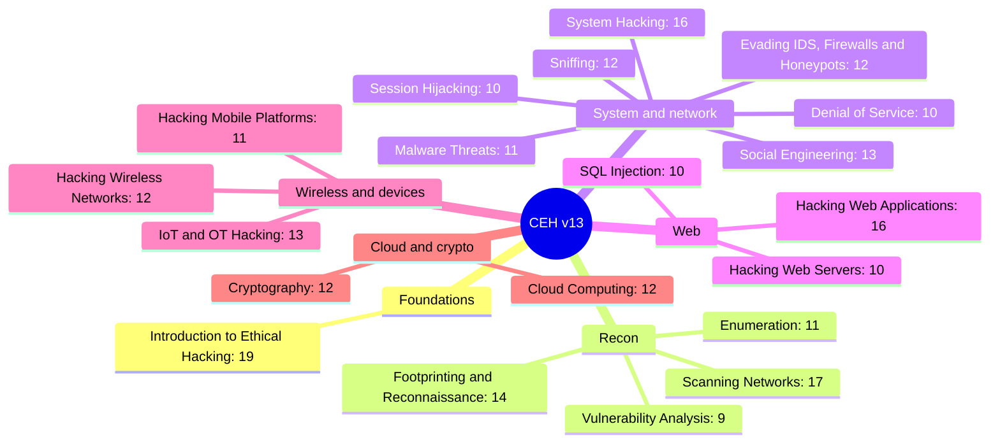

# CEH v13 Revision Sheet

Built from 250 practice questions, grouped by CEH v13 module. Each module has key facts to reread, then a collapsible set of practice questions with answers and a one-line explanation.

## Overview

| # | Module | Questions |
|---|---|---|
| 01 | Introduction to Ethical Hacking | 19 |
| 02 | Footprinting and Reconnaissance | 14 |
| 03 | Scanning Networks | 17 |
| 04 | Enumeration | 11 |
| 05 | Vulnerability Analysis | 9 |
| 06 | System Hacking | 16 |
| 07 | Malware Threats | 11 |
| 08 | Sniffing | 12 |
| 09 | Social Engineering | 13 |
| 10 | Denial of Service | 10 |
| 11 | Session Hijacking | 10 |
| 12 | Evading IDS, Firewalls and Honeypots | 12 |
| 13 | Hacking Web Servers | 10 |
| 14 | Hacking Web Applications | 16 |
| 15 | SQL Injection | 10 |
| 16 | Hacking Wireless Networks | 12 |
| 17 | Hacking Mobile Platforms | 11 |
| 18 | IoT and OT Hacking | 13 |
| 19 | Cloud Computing | 12 |
| 20 | Cryptography | 12 |

## 01 Introduction to Ethical Hacking

**Key facts**

- Five phases, in order: Reconnaissance, Scanning, Gaining access, Maintaining access, Clearing tracks. A backdoor for later = maintaining access
- Hacker types: white hat = authorized, black hat = malicious, gray hat = no authorization but no malicious intent, suicide hacker = ignores consequences
- Threat = potential cause of an unwanted incident. Vulnerability = a weakness. Risk = likelihood x impact. Countermeasure = control that reduces likelihood or impact
- CIA: ransomware attacks Availability. Non-repudiation = a signer cannot deny having signed
- Assessment types: black box = no prior knowledge, gray box = partial, white box = full. Rules of engagement = scope, techniques, timing, contacts
- Cyber Kill Chain: Recon, Weaponization (exploit + payload), Delivery, Exploitation, Installation, C2, Actions on objectives
- MITRE ATT&CK = matrix of tactics and techniques. The Kill Chain is a linear sequence of stages
- APT lifecycle: Preparation, Initial intrusion, Expansion (lateral movement), Persistence, Search and exfiltration, Cleanup
- Threat intelligence: strategic = executives, tactical = TTPs, operational = specific attacks, technical = IoCs such as IPs and hashes
- IoCs = hashes, malicious domains, registry keys used to detect the same threat elsewhere
- Standards: PCI DSS = cardholder data, HIPAA = US health data, GDPR = EU personal data, SOX = financial reporting
- Insider threat = legitimate access misused from inside
- `example.com` is reserved for documentation and testing (RFC 2606), never a real target
- CEH v13 and AI: AI assists every phase, the human verifies and decides

Practice questions (19)

- **S2Q23** A control that is put in place to reduce the likelihood or impact of a risk is best described as a:
  **D) Countermeasure.** A control that lowers likelihood or impact is a countermeasure. A vulnerability is the weakness, an exploit is the attack code.

- **S2Q28** A company must protect stored cardholder data and undergoes a related annual audit. Which standard primarily applies?
  **A) PCI DSS.** Stored cardholder data means PCI DSS. GDPR is EU personal data, HIPAA US health data, SOX financial reporting.

- **S3Q18** During which phase of the hacking methodology does an attacker install a backdoor to retain future access to a compromised host?
  **C) Maintaining access.** Installing a backdoor to come back later is phase 4, maintaining access.

- **S3Q22** Before starting a penetration test, which document defines scope, allowed techniques, timing and contacts?
  **D) Rules of engagement.** Rules of engagement set scope, allowed techniques, timing and contacts. An NDA only covers confidentiality.

- **S4Q13** After the initial foothold, an APT group moves from host to host, harvests additional credentials and deploys tools deeper in the network to reach high-value systems. Which phase of the APT lifecycle is this?
  **D) Expansion (lateral movement).** Moving host to host and harvesting more credentials after the foothold is the expansion phase.

- **S4Q25** In CEH v13, how is AI positioned within the ethical hacking workflow?
  **B) It assists each phase while the human verifies and decides.** In CEH v13, AI supports each phase while the human stays in control of decisions.

- **S5Q3** Which domain is explicitly reserved for documentation and testing, so it should not be scanned as a real target?
  **B) example.com.** example.com, .net and .org are reserved for documentation by RFC 2606.

- **S5Q10** A hacker discovers a flaw and notifies the vendor without exploiting it for personal gain, acting without prior authorization. Which category best fits?
  **D) Gray hat.** No authorization but no malicious intent is gray hat. White hat requires prior authorization.

- **S5Q11** What is the correct definition of a threat in risk terminology?
  **A) A potential cause of an unwanted incident.** A threat is a potential cause. A weakness is a vulnerability, and likelihood x impact is risk.

- **S5Q19** In the Cyber Kill Chain, creating a malicious payload coupled with an exploit corresponds to which stage?
  **C) Weaponization.** Coupling an exploit with a payload into something deliverable is weaponization.

- **S6Q3** Which element of the CIA triad is directly attacked by a ransomware that encrypts files and blocks access?
  **B) Availability.** Blocking access to data hits availability. The data is not stolen, so confidentiality is not the main target.

- **S6Q5** Which option lists the five phases of hacking in the correct order?
  **D) Recon, Scanning, Gaining access, Maintaining access, Clearing tracks.** Recon, Scanning, Gaining access, Maintaining access, Clearing tracks.

- **S6Q6** Which type of assessment gives the tester no prior knowledge of the target's internal architecture?
  **D) Black box.** No prior knowledge is black box. Gray box gets partial knowledge, white box full knowledge.

- **S6Q7** Which framework describes adversary behavior as a matrix of tactics and techniques used after a breach?
  **B) MITRE ATT&CK.** A matrix of tactics and techniques is MITRE ATT&CK. The Kill Chain is a linear set of stages.

- **S6Q8** During an APT campaign, after the first compromise the actors install backdoors and create hidden accounts so they can return even if the entry point is patched. Which phase of the APT lifecycle is this?
  **D) Persistence.** Backdoors and hidden accounts to return after the entry point is patched is persistence.

- **S8Q10** An analyst shares IP addresses and file hashes of a known campaign so defenders can block them. Which type of threat intelligence is this?
  **C) Technical.** IPs and file hashes are technical intelligence: short-lived, machine-readable IoCs.

- **S8Q13** An organization wants assurance that a user who digitally signed a transaction cannot later deny having done so. Which security principle does this provide?
  **C) Non-repudiation.** A digital signature the signer cannot deny gives non-repudiation.

- **S8Q14** A disgruntled employee with legitimate access copies confidential data to sell it. This risk category is:
  **B) Insider threat.** An employee abusing legitimate access is an insider threat.

- **S8Q23** A SOC analyst compiles a list of file hashes, malicious domains and a specific registry Run key used by a campaign, to detect the same threat on other machines. These artifacts are collectively known as what?
  **C) Indicators of Compromise (IoCs).** Hashes, domains and registry keys used for detection are Indicators of Compromise.

## 02 Footprinting and Reconnaissance

**Key facts**

- Passive footprinting = public sources only, never touches the target, so it leaves no trace. Active = interacts with the target
- Job postings reveal the tech stack: competitive intelligence through passive footprinting
- Google dorks: `site:` one domain, `filetype:` extension, `intitle:` / `inurl:` match title or URL, `related:` similar sites
- Tools: theHarvester = emails, subdomains, hosts. FOCA = document metadata. Shodan = internet-connected devices and banners. Maltego = relationship graph
- Whois = registrar, creation date, registrant contacts. Traceroute = network path and hops
- DNS records: MX = mail servers, NS = name servers, A = IPv4, AAAA = IPv6, CNAME = alias
- Zone transfer (AXFR) hands over the whole zone. Countermeasure: allow it only to authorized secondary servers

Practice questions (14)

- **S2Q9** Which tool queries public sources to harvest emails, subdomains and hosts for a given domain?
  **C) theHarvester.** theHarvester queries public sources for emails, subdomains and hosts.

- **S4Q23** A primary countermeasure against DNS footprinting and uncontrolled zone transfers is to:
  **C) Restrict zone transfers to authorized secondary servers.** Restricting AXFR to authorized secondaries stops anyone downloading the whole zone.

- **S4Q31** An investigator wants the registrar, creation date and registrant contacts of a domain. Which lookup is most appropriate?
  **D) Whois.** Whois returns the registrar, creation date and registrant contacts.

- **S5Q14** Which Google dork restricts results to a single domain?
  **B) site:.** site: restricts results to one domain.

- **S5Q20** Which Google advanced operator helps find sites similar to a given URL?
  **B) related:.** related: finds sites similar to a given URL.

- **S6Q19** An attacker gathers employee names and emails only from public social media and search engines, never contacting the target's systems. This is:
  **D) Passive footprinting.** Using only public sources without contacting the target is passive footprinting.

- **S6Q27** An attacker uses traceroute during footprinting mainly to:
  **B) Map the network path and intermediate hops to the target.** Traceroute maps the path and intermediate hops to the target.

- **S7Q1** Why is passive reconnaissance generally preferred before active techniques?
  **C) It leaves no trace on the target.** Passive recon never interacts with the target, so it leaves no trace.

- **S7Q8** An attacker extracts metadata (author, software, paths) from public documents on a target's website. Which tool is purpose-built for this?
  **A) FOCA.** FOCA extracts metadata (authors, software, paths) from public documents.

- **S7Q9** A search engine that indexes Internet-connected devices and their banners, useful to find exposed services, is:
  **B) Shodan.** Shodan indexes internet-connected devices and their banners.

- **S7Q16** A DNS zone transfer (AXFR) that succeeds against a public server is dangerous because it:
  **B) Copies the entire zone's records to the attacker.** A successful zone transfer gives the attacker every record, a full map of hosts.

- **S7Q17** Which tool is designed to visualize relationships between people, domains, emails and infrastructure as a graph?
  **D) Maltego.** Maltego visualizes relationships between people, domains and infrastructure.

- **S7Q18** Which record type must be queried to identify the mail servers responsible for a domain?
  **D) MX.** MX records list the mail servers for a domain.

- **S7Q27** An attacker reads a company's job postings to learn which technologies and versions it runs. This is an example of:
  **A) Competitive intelligence via passive footprinting.** Reading job postings to learn the technologies in use is competitive intelligence, passive.

## 03 Scanning Networks

**Key facts**

- SYN scan `-sS`: SYN, then RST on SYN/ACK, never completes the handshake. Open = SYN/ACK, closed = RST
- Connect scan `-sT`: full handshake, most reliable but easiest to log
- NULL / FIN / Xmas: a closed port answers RST (RFC 793), an open port stays silent. Xmas sets FIN, PSH and URG
- ACK scan: RST on every port means unfiltered (stateless firewall or none). No response means filtered
- Idle (zombie) scan `-sI`: uses a third host's IP ID, so the attacker's IP never reaches the target
- Nmap flags: `-sn` host discovery only, `-sV` versions, `-O` OS, `-T4` aggressive timing
- Evasion: `-D` decoys hide the real IP among many fakes. `-S` spoofs one source. `-f` fragments packets
- OS fingerprinting from initial TTL and TCP window size = active stack fingerprinting
- Banner grabbing = reading the banner an open port returns. hping3 = custom packet crafting
- Defense: IDS/IPS plus rate-limiting new connections at the edge

Practice questions (17)

- **S1Q3** A scanner sends only a SYN and tears down the connection on SYN/ACK without completing the handshake. Which scan is this?
  **D) SYN (half-open) scan.** Sending SYN then tearing down on SYN/ACK without completing the handshake is a half-open scan.

- **S1Q19** Which technique reads the service banner returned by an open port to identify the software and version?
  **A) Banner grabbing.** Reading the banner an open service returns is banner grabbing.

- **S1Q23** On a closed port, how does a target respond to a NULL, FIN or Xmas scan (per RFC 793)?
  **B) RST.** Per RFC 793, a closed port answers RST. No response means open or filtered.

- **S1Q24** Which scan is most reliable but also the easiest to log because it completes the full three-way handshake?
  **B) TCP connect scan.** Completing the full three-way handshake makes the connect scan reliable but logged.

- **S1Q27** Which Nmap timing template is the fastest (most aggressive) commonly used value?
  **D) -T4.** -T4 (aggressive) is the fastest commonly used template. -T0 and -T1 are the slowest.

- **S2Q15** An idle (zombie) scan is notable because it:
  **A) Scans ports without the attacker's IP appearing to the target.** The idle scan bounces through a zombie, so the target never sees the attacker's IP.

- **S2Q17** A key countermeasure to detect and slow port scanning at the network edge is to:
  **D) Deploy an IDS/IPS and rate-limit new connections.** An IDS/IPS detects scans, and rate-limiting new connections slows them down.

- **S3Q2** An Xmas scan sets which TCP flags?
  **D) FIN, PSH and URG.** Xmas lights up FIN, PSH and URG.

- **S3Q28** Which tool crafts custom TCP/IP packets and is often used to test firewall rules and perform advanced scans?
  **C) hping3.** hping3 crafts custom TCP/IP packets, useful for testing firewall rules.

- **S4Q6** Which Nmap option adds multiple spoofed decoy source addresses to a scan to hide the real scanner?
  **C) -D.** -D adds decoy source addresses. -S spoofs a single source, -f fragments, -g sets the source port.

- **S4Q21** Sending the scan through many decoy source IPs so the real origin is hidden among them is:
  **C) Decoy scanning.** Hiding the real scanner among many decoy IPs is decoy scanning, nmap -D.

- **S4Q29** During a stealth scan, an attacker splits the probe into tiny IP fragments to evade signature-based IDS. This technique is:
  **A) IP fragmentation.** Splitting probes into tiny IP fragments to slip past signature IDS is fragmentation.

- **S6Q9** An attacker fingerprints the OS of a host partly from the initial TTL and TCP window size of its replies. This relies on:
  **C) Active stack fingerprinting.** Sending probes and reading TTL and window size is active stack fingerprinting.

- **S6Q22** Which Nmap flag performs host discovery only, without scanning ports?
  **A) -sn.** -sn does host discovery only, no port scan. -Pn is the opposite: skip discovery.

- **S7Q28** Which Nmap option enables service and version detection on open ports?
  **B) -sV.** -sV detects services and versions. -O detects the OS.

- **S8Q18** An ACK scan returns RST for every probed port. What can the tester conclude?
  **D) The ports are unfiltered (a stateless firewall or none).** RST to every ACK probe means the packets reach the host unfiltered.

- **S8Q24** On a SYN scan, which response indicates an open port?
  **D) SYN/ACK.** SYN/ACK in reply to a SYN means the port is open.

## 04 Enumeration

**Key facts**

- NetBIOS: 137 name, 138 datagram, 139 session. SMB runs directly on TCP 445
- Null session = anonymous SMB/IPC$ connection without credentials (legacy Windows)
- enum4linux = SMB users, shares and password policy. Defense: filter 137-139 and 445 at the edge, disable SMBv1
- SNMP (UDP 161/162): default community string `public` reads the MIB
- LDAP 389, LDAPS 636. Defense: disable anonymous bind, require LDAPS or StartTLS
- SMTP `VRFY` and `EXPN` reveal whether users or mailboxes exist
- NFS exposes mountable exported file systems. NTP runs on UDP 123 and monlist can leak host lists

Practice questions (11)

- **S1Q7** An attacker uses the default community string 'public' to read a device's MIB. Which protocol is being enumerated?
  **C) SNMP.** Community strings and the MIB belong to SNMP.

- **S1Q21** Which service runs directly on TCP port 445 and is a frequent enumeration target on Windows?
  **C) Server Message Block (SMB).** SMB runs directly over TCP 445.

- **S2Q31** Which countermeasure most directly reduces NetBIOS/SMB enumeration exposure at the network edge?
  **C) Block/filter 137-139 and 445 and disable SMBv1.** Filtering 137-139 and 445 and disabling SMBv1 removes the exposure.

- **S4Q9** Which enumeration target typically exposes exported file systems a client can mount over the network?
  **D) NFS.** NFS exports file systems that clients can mount (showmount -e lists them).

- **S7Q5** A 'null session' on legacy Windows refers to:
  **B) An anonymous SMB/IPC$ connection without credentials.** A null session is an anonymous IPC$ connection with no credentials.

- **S7Q21** Which port does LDAP over SSL/TLS (LDAPS) use by default?
  **C) 636.** LDAPS uses 636. Plain LDAP is 389.

- **S7Q31** Which SMTP commands can be abused to verify whether a mailbox or user exists on a server?
  **A) VRFY and EXPN.** VRFY confirms a user and EXPN expands a mailing list.

- **S8Q4** Which tool is commonly used to enumerate SMB users, shares and password policy on Windows/Samba hosts?
  **D) enum4linux.** enum4linux enumerates SMB users, shares and password policy.

- **S8Q7** Which ports are historically associated with NetBIOS name and session services?
  **C) 137-139.** NetBIOS uses 137 to 139. 161/162 is SNMP, 389/636 is LDAP.

- **S8Q27** An unauthenticated attacker queries LDAP to list usernames, groups and organizational units. A core countermeasure is to:
  **B) Disable anonymous bind and require LDAPS/StartTLS.** Disabling anonymous bind and forcing LDAPS/StartTLS stops unauthenticated listing.

- **S8Q29** On which UDP port does NTP typically operate, a service that can leak host lists via monlist-style queries?
  **C) 123.** NTP runs on UDP 123.

## 05 Vulnerability Analysis

**Key facts**

- CVE = one specific flaw. CWE = weakness category. CVSS = severity score. CPE = product naming. NVD = US feed enriching CVEs with CVSS, CWE and CPE
- CVSS v3.1 Base metrics: Attack Vector, Attack Complexity, Privileges Required, User Interaction, Scope, C/I/A. Report Confidence is Temporal
- CVSS v4.0 renamed Temporal to Threat and added a Supplemental group
- Credentialed scan = logs in, fewer false positives, sees missing patches from inside. Agent-based = for laptops rarely on the network
- Lifecycle ends with Remediation, then Verification (rescan to confirm the fix), then Monitoring
- False positive = reported but not real. OpenVAS (Greenbone) = free, self-hosted scanner

Practice questions (9)

- **S1Q26** In CVSS v3.1, which of the following is NOT one of the Base metric group metrics?
  **B) Report Confidence.** Report Confidence belongs to the Temporal group, not Base.

- **S3Q27** To reduce false positives and obtain an accurate list of missing patches and misconfigurations as seen from inside each Windows host, an analyst configures the scanner with valid domain credentials. Which type of scan is being performed?
  **B) Credentialed (authenticated) scan.** Scanning with valid credentials is an authenticated scan: more accurate, fewer false positives.

- **S4Q17** An organization needs to assess laptops that are frequently off the corporate network and rarely reachable by a central scanner. Which scanning approach best ensures continuous coverage?
  **D) Agent-based (host-resident) scanning.** Hosts that are rarely reachable need a resident agent.

- **S6Q13** A security analyst is documenting the severity of a flaw and notices that the scoring framework has replaced the Temporal metric group with a renamed group and added a Supplemental group. Which version of CVSS introduced these changes?
  **C) CVSS v4.0.** CVSS v4.0 replaced Temporal with Threat and added Supplemental metrics.

- **S7Q20** An analyst wants a reference that classifies the generic categories of software weaknesses (such as improper input validation or use-after-free) rather than specific product flaws. Which resource should the analyst consult?
  **B) CWE.** CWE classifies weakness types. CVE is a specific flaw, CVSS a score, CPE a product name.

- **S7Q29** An analyst wants a U.S. government feed that takes published CVE entries and enriches them with CVSS scores, CWE mappings and affected-product data. Which database provides this?
  **C) NVD.** NVD takes CVEs and adds CVSS scores, CWE mappings and affected products.

- **S7Q30** After scanning and prioritizing, a team applies patches and configuration changes, then runs a new scan specifically to confirm the issues no longer appear. Which phase of the vulnerability management lifecycle is the confirmation scan part of?
  **D) Verification.** The rescan that confirms a fix is verification.

- **S8Q19** A vulnerability scanner reports that a server is vulnerable to a flaw, but manual verification proves the patch is applied and the service is not exploitable. How should this result be classified?
  **C) False positive.** A reported flaw that is not actually exploitable is a false positive.

- **S8Q30** A school wants a fully free and open-source vulnerability scanner it can host itself, built around a continuously updated feed of network vulnerability tests. Which solution fits?
  **A) OpenVAS (Greenbone).** OpenVAS (Greenbone) is free, open source and self-hosted.

## 06 System Hacking

**Key facts**

- Kerberos = time-stamped tickets from a KDC. NTLM = challenge-response
- Password attacks: dictionary, brute force, hybrid = words + appended digits/symbols, rainbow tables beaten by salts. Key stretching (PBKDF2, bcrypt) slows cracking
- hashcat: `-a 0` straight, `-a 1` combinator, `-a 3` mask, `-m 1000` NTLM. John needs `unshadow /etc/passwd /etc/shadow` first
- Pass-the-hash = authenticate with the hash itself, no cracking. Kerberoasting = request tickets for SPN accounts, crack offline
- Mimikatz `sekurlsa::logonpasswords` dumps creds from LSASS. Responder poisons LLMNR and NBT-NS to grab NetNTLMv2 hashes
- Privilege escalation: vertical = user to SYSTEM/admin, horizontal = another user at the same level. Meterpreter `getsystem` = local privesc. DLL hijacking = malicious DLL earlier in the search order
- Persistence = Run keys, scheduled tasks. Clearing tracks: `wevtutil cl Security`
- Hiding data: NTFS alternate data streams (`dir /r` reveals them). Detecting hidden data in images = steganalysis

Practice questions (16)

- **S1Q12** Which statement correctly contrasts Kerberos with NTLM authentication in a Windows domain?
  **B) Kerberos uses time-stamped tickets issued by a Key Distribution Center, while NTLM uses a challenge-response handshake.** Kerberos uses KDC tickets with timestamps. NTLM uses challenge-response.

- **S1Q14** An attacker takes a dictionary of common words and automatically appends digits and symbols to each word (for example Summer, then Summer1, Summer!). Which password attack type is this?
  **B) Hybrid attack.** A dictionary plus mutations (Summer1, Summer!) is a hybrid attack.

- **S1Q32** During post-exploitation on a Windows host, an attacker runs a well-known tool and uses the module below to read plaintext passwords and hashes from the LSASS process: sekurlsa::logonpasswords Which tool is being used?
  **B) Mimikatz.** sekurlsa::logonpasswords is the Mimikatz module that reads LSASS.

- **S2Q29** A standard user exploits a flaw that gives them SYSTEM-level rights on the same machine, moving from limited access to full administrative control. Which class of privilege escalation is this?
  **B) Vertical privilege escalation.** Going from standard user to SYSTEM is vertical escalation.

- **S3Q20** Before cracking Linux credentials with John the Ripper, an analyst needs to merge the account data from two files into a single file John can process. Which command performs this merge?
  **D) unshadow /etc/passwd /etc/shadow &gt; creds.txt.** unshadow merges passwd and shadow into one file John can crack.

- **S4Q8** An attacker has recovered a user's NTLM hash from memory and authenticates to other systems by supplying the hash directly, without ever cracking it to plaintext. Which technique is being used?
  **C) Pass-the-hash.** Authenticating with the NTLM hash directly is pass-the-hash.

- **S4Q11** After gaining access, an attacker creates a registry Run key and a scheduled task that re-launch their backdoor each time the system boots. Which goal of the system-hacking methodology does this serve?
  **D) Maintaining access (persistence).** Run keys and scheduled tasks relaunching a backdoor are persistence.

- **S5Q17** To cover their tracks after an intrusion, an attacker wants to wipe the Windows Security event log from the command line. Which command accomplishes this?
  **D) wevtutil cl Security.** wevtutil cl Security clears the Security event log.

- **S5Q30** An investigator suspects data is hidden in NTFS alternate data streams. Which command reveals files that have alternate data streams attached in the current directory?
  **B) dir /r.** dir /r lists alternate data streams.

- **S6Q2** On a Meterpreter session running as a service account, an attacker issues getsystem, which abuses named pipe impersonation to obtain the SYSTEM token. This is an example of what?
  **C) Local privilege escalation.** getsystem impersonating a SYSTEM token on the same host is local privilege escalation.

- **S6Q14** On an internal pentest, an analyst launches Responder to answer broadcast name-resolution queries from Windows hosts and collects NetNTLMv2 hashes. Which legitimate protocols is Responder abusing?
  **B) LLMNR and NBT-NS.** Responder answers LLMNR and NBT-NS broadcasts to capture hashes.

- **S6Q18** To make offline cracking of stored passwords far slower, a developer applies a deliberately expensive key-derivation function with many iterations, such as PBKDF2 or bcrypt. What is this defense called?
  **C) Key stretching.** Deliberately slow, iterated KDFs like PBKDF2 or bcrypt are key stretching.

- **S6Q21** An analyst suspects a JPEG image carries hidden data embedded in the least significant bits of its pixels. The process of detecting the presence of such hidden content is called what?
  **B) Steganalysis.** Detecting hidden content is steganalysis. Hiding it is steganography.

- **S7Q24** An attacker places a malicious library in a directory that a trusted application searches before the legitimate system path, so the application loads the attacker's code with its privileges. Which technique is this?
  **A) DLL hijacking.** A malicious DLL placed earlier in the search path is DLL hijacking.

- **S8Q28** After compromising a low-privilege domain account, an attacker requests Kerberos service tickets for accounts that have a Service Principal Name set, then takes them offline to recover the service account passwords. Which attack is this?
  **B) Kerberoasting.** Requesting tickets for SPN accounts and cracking them offline is Kerberoasting.

- **S8Q31** A tester runs the following command: hashcat -m 1000 -a 3 hashes.txt ?u?l?l?l?l?d?d What kind of password attack does the -a 3 option specify?
  **B) Mask (brute-force) attack.** -a 3 is a mask attack. -a 0 is straight dictionary, -a 1 combinator.

## 07 Malware Threats

**Key facts**

- Fileless = runs in memory via PowerShell/WMI, nothing on disk. Macro virus = document scripting language
- Worm = self-replicates across networks without a host file. Virus needs a host file
- Reverse (connect-back) trojan = the victim connects out to the attacker, getting past outbound-permissive firewalls
- Crypto ransomware encrypts files, locker ransomware locks the screen. Best defense: tested offline backups
- Hypervisor rootkit = runs under the OS as a VM monitor
- Crypter = encrypts/obfuscates to beat AV signatures. Dropper installs malware, wrapper binds it to a legit file
- Sandbox evasion = checks for VM artifacts, few CPUs, no mouse movement. Dynamic analysis = run it in a sandbox and watch
- Botnet = remotely controlled compromised hosts

Practice questions (11)

- **S1Q1** An incident responder finds no malicious file on disk: the attack runs entirely in memory through PowerShell and WMI, abusing tools already present on the system. Which malware category is this?
  **A) Fileless malware.** Living in memory through PowerShell and WMI with no file on disk is fileless malware.

- **S1Q5** Which characteristic distinguishes a worm from a classic file-infecting virus?
  **D) A worm self-replicates and spreads across networks without needing to attach to a host file.** A worm spreads by itself across networks without attaching to a host file.

- **S1Q6** A trojan is configured so that the infected host initiates the connection outward to the attacker's listener, helping it get past outbound-permissive firewalls. What is this trojan communication model called?
  **B) Reverse (connect-back) trojan.** The infected host connecting out to the attacker is a reverse (connect-back) trojan.

- **S1Q30** An accountant opens a spreadsheet, enables content, and malicious code written in the document's built-in scripting language runs and infects other documents. Which virus type is this?
  **C) Macro virus.** Code in the document's built-in scripting language is a macro virus.

- **S3Q1** Users report that their documents and photos have been renamed with a new extension and are unreadable, and a note demands payment in cryptocurrency for a decryption key. Which malware category best fits?
  **A) Crypto ransomware.** Encrypted files plus a ransom note is crypto ransomware. Locker ransomware locks the device instead.

- **S3Q4** Which rootkit type runs beneath the operating system by loading as a virtual machine monitor, so the compromised OS runs as a guest and is unaware of it?
  **B) Hypervisor (virtualized) rootkit.** A rootkit that runs as a VM monitor under the OS is a hypervisor rootkit.

- **S3Q16** A sample refuses to execute its payload when it detects known virtual-machine artifacts, few CPU cores or no mouse movement. What is the purpose of this behavior?
  **D) To evade automated sandbox analysis.** Checking for VM artifacts before running is sandbox evasion.

- **S6Q20** A network of compromised hosts remotely controlled to launch coordinated attacks is a:
  **A) Botnet.** A network of remotely controlled compromised hosts is a botnet.

- **S6Q26** A malware author wants to encrypt and obfuscate a trojan so that antivirus engines cannot match its signature, while keeping it fully functional once executed. Which component performs this role?
  **A) Crypter.** A crypter encrypts the payload so signatures do not match.

- **S8Q1** Which countermeasure most directly limits the damage of a crypto-ransomware outbreak and enables recovery without paying?
  **A) Maintaining tested, offline (offsite) backups.** Tested offline backups allow recovery without paying.

- **S8Q11** An analyst detonates an unknown sample in an isolated sandbox and records the API calls, files created and network connections it makes at runtime. Which malware analysis approach is this?
  **D) Dynamic (behavioral) analysis.** Running the sample and recording its behavior is dynamic analysis.

## 08 Sniffing

**Key facts**

- Passive sniffing only works on hubs or shared/mirrored segments. Switched networks need active attacks
- MAC flooding overflows the CAM table so the switch broadcasts. Defense: port security
- ARP poisoning binds the gateway IP to the attacker's MAC. Defense: Dynamic ARP Inspection, which checks DHCP snooping bindings
- Rogue DHCP server hands out a malicious gateway/DNS. Defense: DHCP snooping, trusting server replies only on designated ports
- VLAN hopping = double-tagged 802.1Q frames. DNS cache poisoning = a resolver returns the attacker's IP
- tcpdump uses BPF capture filters. Wireshark display filter `ip.addr==10.0.0.5` = to or from that host
- Defense against credential sniffing: TLS end to end

Practice questions (12)

- **S1Q8** A rogue host answers DHCP requests faster than the legitimate server, handing clients a malicious gateway and DNS. This is a:
  **B) Rogue DHCP server attack.** A host answering DHCP faster with a malicious gateway is a rogue DHCP server.

- **S1Q17** An attacker crafts a double-tagged 802.1Q frame to send traffic from one VLAN into another. This is:
  **A) VLAN hopping.** Double-tagged 802.1Q frames to reach another VLAN is VLAN hopping.

- **S2Q6** Which command-line tool captures packets and applies BPF capture filters from the terminal?
  **D) tcpdump.** tcpdump captures from the terminal with BPF filters.

- **S2Q25** Which deployment most reliably prevents credential sniffing of a web login over a shared segment?
  **B) TLS (HTTPS) end to end.** TLS end to end makes sniffed credentials unreadable.

- **S3Q11** Poisoning a resolver's cache so a legitimate hostname resolves to an attacker's IP is called:
  **A) DNS cache poisoning.** Poisoning a resolver's cache to return the attacker's IP is DNS cache poisoning.

- **S4Q19** Which countermeasure validates ARP replies against DHCP snooping bindings to stop ARP poisoning?
  **C) Dynamic ARP Inspection.** Dynamic ARP Inspection validates ARP replies against DHCP snooping bindings.

- **S4Q26** Which attack lets a sniffer intercept traffic on a switched LAN by sending forged ARP replies that bind the gateway's IP to the attacker's MAC?
  **C) ARP poisoning.** Forged ARP replies binding the gateway IP to the attacker's MAC is ARP poisoning.

- **S5Q1** Which Wireshark display filter shows only traffic to or from host 10.0.0.5?
  **A) ip.addr==10.0.0.5.** ip.addr== matches the address as source or destination.

- **S5Q16** An attacker floods a switch with countless fake MAC addresses until its CAM table overflows and it starts broadcasting frames to all ports. This attack is:
  **C) MAC flooding.** Overflowing the CAM table with fake MACs is MAC flooding.

- **S6Q1** Which switch feature limits the number of MAC addresses per port and is a direct countermeasure to MAC flooding?
  **C) Port security.** Port security limits MAC addresses per port.

- **S6Q25** DHCP snooping protects a network mainly by:
  **C) Trusting DHCP server replies only on designated ports.** DHCP snooping only trusts server replies on designated ports.

- **S7Q13** Passive sniffing works without injecting traffic primarily in which environment?
  **D) A hub-based or mirrored/shared segment.** Passive sniffing needs a hub or a shared/mirrored segment.

## 09 Social Engineering

**Key facts**

- Phishing channels: smishing = SMS, vishing = voice, quishing = QR code, whaling = senior executive, spear phishing = targeted individual
- Pharming = DNS or hosts-file redirection. Phishing = a lure link
- Quid pro quo = something offered in exchange. Baiting = infected USB left around
- Tailgating/piggybacking = following someone through a secure door. Defense: mantraps/turnstiles plus badge awareness
- Emerging: deepfake voice for fraud, SIM swapping to intercept OTPs
- Gophish runs authorized phishing campaigns. Best defense overall: awareness training plus verification procedures

Practice questions (13)

- **S1Q13** A phishing attack delivered by SMS to trick users into a malicious link is:
  **D) Smishing.** Phishing by SMS is smishing.

- **S2Q26** A phishing message contains a malicious QR code that leads to a credential-harvesting page. This is:
  **C) Quishing.** A malicious QR code is quishing.

- **S5Q7** An attacker leaves infected USB drives in a parking lot hoping an employee plugs one in. This technique is:
  **C) Baiting.** Infected USB drives left for employees is baiting.

- **S5Q13** Which open-source toolkit is commonly used to run authorized phishing awareness campaigns and track results?
  **B) Gophish.** Gophish runs and tracks phishing awareness campaigns.

- **S5Q18** What is the key difference between phishing and pharming?
  **A) Pharming redirects victims via DNS/hosts manipulation, phishing lures them with a crafted link.** Pharming redirects through DNS or hosts manipulation. Phishing lures with a link.

- **S5Q27** The strongest organizational countermeasure against social engineering is:
  **A) Regular security awareness training and verification procedures.** Regular awareness training plus verification procedures is the strongest control.

- **S6Q4** Attackers synthesize a manager's voice to call the finance team and request an urgent transfer. This emerging threat is:
  **A) Deepfake-driven social engineering.** A synthesized manager's voice is deepfake-driven social engineering.

- **S6Q30** A targeted phishing email is crafted for one senior executive using details about their role. This is best described as:
  **B) Whaling.** A phish tailored to one senior executive is whaling.

- **S7Q3** An attacker convinces a carrier to port a victim's number to a new SIM to intercept OTP codes. This is:
  **B) SIM swapping.** Convincing the carrier to move a number to a new SIM is SIM swapping.

- **S7Q22** Phishing by voice call, often spoofing a bank or IT support, is called:
  **D) Vishing.** Phishing by voice call is vishing.

- **S8Q3** Which approach best reduces the success of tailgating at a building entrance?
  **C) Mantraps/turnstiles with badge and guard awareness.** Mantraps and turnstiles with badges stop tailgating.

- **S8Q8** An attacker calls an employee pretending to be IT and offers to 'fix' an issue in exchange for their password. This is:
  **B) Quid pro quo.** Offering a fix in exchange for a password is quid pro quo.

- **S8Q22** An employee holds a secure door open for a stranger carrying boxes, who has no badge. This physical intrusion is:
  **B) Tailgating (piggybacking).** Following someone through a held-open secure door is tailgating or piggybacking.

## 10 Denial of Service

**Key facts**

- SYN flood = spoofed SYNs never completed, exhausting the connection table. Defense: SYN cookies (no state until the handshake completes)
- Smurf = ICMP echo to a broadcast address with the victim's spoofed source. Fraggle is the UDP version
- DRDoS / amplification (DNS, NTP) = spoof the victim's source so large responses flood it. Defense: egress filtering of spoofed sources
- Slowloris = many slow, partial HTTP requests. Ping of death = oversized packets that crash on reassembly
- Permanent DoS (phlashing) = damaged firmware, hardware must be reflashed or replaced
- Detection: activity profiling against a normal baseline. Volumetric attacks: upstream scrubbing / cloud mitigation

Practice questions (10)

- **S1Q15** A permanent DoS (phlashing) is distinctive because it:
  **C) Damages firmware so hardware must be replaced or reflashed.** Phlashing damages firmware so the hardware must be reflashed or replaced.

- **S1Q18** Which technique detects DoS by modeling normal traffic and alerting on deviations?
  **B) Activity profiling.** Modeling normal traffic and alerting on deviations is activity profiling.

- **S1Q22** A volumetric DDoS is best absorbed by:
  **D) Upstream scrubbing / cloud DDoS mitigation and rate limiting.** Volumetric floods are absorbed upstream by scrubbing centers or cloud mitigation.

- **S1Q29** A Smurf attack amplifies traffic by sending ICMP echo requests with the victim's spoofed source to:
  **D) A network broadcast address.** Smurf sends ICMP echo to a broadcast address with the victim's spoofed source.

- **S2Q14** Which application-layer DoS keeps many HTTP connections open by sending partial requests very slowly?
  **C) Slowloris.** Slow partial HTTP requests holding connections open is Slowloris.

- **S2Q19** Which countermeasure specifically mitigates SYN floods by not allocating state until the handshake completes?
  **A) SYN cookies.** SYN cookies avoid allocating state until the handshake completes.

- **S3Q25** A distributed reflection DoS (DRDoS) using DNS or NTP relies mainly on:
  **C) Spoofing the victim's source so large responses flood it.** Reflection attacks spoof the victim's source so big responses hit it.

- **S4Q18** An attacker sends a flood of SYN packets with spoofed sources and never completes the handshake, exhausting the server's connection table. This is a:
  **A) SYN flood.** Spoofed SYNs never completed exhaust the table: a SYN flood.

- **S7Q23** Which filtering practice blocks spoofed source addresses leaving a network and helps curb DoS amplification?
  **A) Egress filtering.** Egress filtering drops packets with spoofed sources leaving the network.

- **S7Q26** Which DoS sends oversized or malformed packets that crash a vulnerable target when reassembled?
  **D) Ping of death.** Oversized packets that crash the target on reassembly are a ping of death.

## 11 Session Hijacking

**Key facts**

- Application level = steal or forge the web session token. Network level = TCP, e.g. sequence prediction or forged RST
- Session fixation = victim is forced onto a session ID the attacker knows. Defense: regenerate the ID at login
- Token theft + replay = hijacking without the password. Defense: long random tokens with server-side expiry
- Cookie flags: HttpOnly = no JavaScript access, Secure = HTTPS only, SameSite = not sent cross-site
- Sidejacking = sniffing session cookies over cleartext. Defense: HSTS and HTTPS everywhere
- Man-in-the-browser = malware in the browser altering transactions in an authenticated session

Practice questions (10)

- **S1Q2** Which best describes application-level session hijacking?
  **C) Stealing or forging the session token used by the web app.** Application-level hijacking steals or forges the web app's session token.

- **S2Q11** A short, randomly generated session token with server-side expiration primarily mitigates:
  **A) Token prediction/brute forcing of session IDs.** Long, random, expiring tokens defeat prediction and brute forcing.

- **S3Q26** Regenerating the session identifier immediately after a successful login primarily prevents:
  **B) Session fixation.** Issuing a new session ID at login defeats fixation.

- **S4Q7** Sending a forged RST to abruptly terminate a victim's TCP session is an example of:
  **C) RST hijacking (connection reset).** A forged RST that kills the victim's connection is RST hijacking.

- **S4Q20** Which cookie attributes most directly reduce session token theft via scripts and cross-site requests?
  **C) HttpOnly, Secure and SameSite.** HttpOnly, Secure and SameSite block script access, cleartext and cross-site sending.

- **S5Q28** Network-level hijacking that guesses or infers TCP sequence numbers to inject into an established connection is called:
  **C) TCP sequence prediction.** Guessing TCP sequence numbers to inject into a connection is sequence prediction.

- **S6Q12** Malware that sits inside the browser to alter transactions in real time while the session is authenticated is a:
  **A) Man-in-the-browser.** Malware inside the browser altering live transactions is man-in-the-browser.

- **S6Q31** Enforcing HSTS and HTTPS everywhere primarily defeats which hijacking vector?
  **B) Sidejacking (sniffing session cookies over cleartext).** HSTS forces HTTPS, so session cookies cannot be sniffed in cleartext.

- **S7Q14** In session fixation, the attacker:
  **C) Forces the victim to use a session ID the attacker already knows.** Fixation makes the victim use a session ID the attacker already knows.

- **S8Q21** An attacker steals a valid session cookie and replays it to impersonate the user without knowing the password. This is:
  **D) Session hijacking via token theft.** Replaying a stolen session cookie is hijacking via token theft.

## 12 Evading IDS, Firewalls and Honeypots

**Key facts**

- IDS outcomes: false positive = alert on benign traffic, false negative = real attack missed (the most dangerous)
- Ptacek-Newsham: insertion = IDS accepts packets the host rejects. Evasion = host accepts packets the IDS rejects
- Evasion techniques: session splicing (attack split over small TCP segments), Unicode/hex obfuscation, DNS tunneling for C2
- Firewalking = crafted TTLs to map which ports a firewall allows
- Stateful firewall tracks connection state. DMZ = segment for public services isolated from the LAN
- Honeypot = decoy with no production role. Sinkholing = redirect malicious traffic to analysis (blackholing just drops it)
- Snort rule actions: `alert`, `log`, `pass`, `drop`

Practice questions (12)

- **S2Q3** Tunneling command-and-control traffic inside DNS queries to bypass egress filtering is:
  **A) DNS tunneling.** Hiding C2 inside DNS queries to get past egress filters is DNS tunneling.

- **S3Q13** A firewall that tracks the state of connections and only allows replies to initiated sessions is a:
  **C) Stateful firewall.** Tracking connection state and only allowing replies is a stateful firewall.

- **S3Q15** An IDS raises an alert for normal administrative traffic that is not malicious. This is a:
  **D) False positive.** An alert on benign traffic is a false positive.

- **S3Q29** Encoding an attack with Unicode or hex to avoid matching a plaintext IDS signature is:
  **B) Obfuscation/encoding evasion.** Unicode or hex encoding to dodge plaintext signatures is obfuscation.

- **S4Q5** Probing a firewall by sending packets with crafted TTLs to map which ports are allowed through is:
  **C) Firewalking.** Crafted TTLs to map allowed ports through a firewall is firewalking.

- **S4Q12** In Ptacek-Newsham terms, an attack where the IDS accepts packets the end host will reject is an:
  **C) Insertion attack.** The IDS accepting packets the host rejects is an insertion attack.

- **S4Q27** A network segment that exposes public services while isolating the internal LAN is called a:
  **B) DMZ.** A segment exposing public services while isolating the LAN is a DMZ.

- **S6Q16** The most dangerous IDS outcome, where a real attack goes undetected, is a:
  **C) False negative.** A real attack with no alert is a false negative, the most dangerous outcome.

- **S6Q24** A decoy system designed to attract and study attackers, with no production role, is a:
  **C) Honeypot.** A decoy built to attract and study attackers is a honeypot.

- **S7Q10** Redirecting malicious traffic to a controlled analysis destination instead of simply dropping it is called:
  **C) Sinkholing.** Redirecting malicious traffic to an analysis destination is sinkholing.

- **S8Q16** Which Snort rule action would generate an alert when matching traffic is seen?
  **A) alert.** The alert action generates an alert on a match.

- **S8Q20** Splitting an attack across multiple small TCP segments to slip past an IDS that does not reassemble streams is:
  **C) Session splicing.** Splitting the attack over small TCP segments is session splicing.

## 13 Hacking Web Servers

**Key facts**

- Fingerprinting: banner grabbing (`nc` + `HEAD / HTTP/1.0`), `nmap -sV --script=http-enum,http-headers`. Hide versions on Apache with `ServerTokens Prod` + `ServerSignature Off`
- Nikto = web server scanner for dangerous files, outdated software and misconfigurations
- HTTP response splitting = CR/LF injected into a response header. Web cache poisoning = an unkeyed input reflected into a cached response
- DNS server hijacking = attacker changes the authoritative NS records, e.g. via the registrar account
- Directory traversal: `....//` beats a filter that strips `../` only once
- Hardening: remove default accounts, patch on a schedule

Practice questions (10)

- **S1Q20** An administrator hardening an Apache server wants to stop the server from disclosing its exact version and OS in HTTP responses to limit banner grabbing. Which directive change achieves this most directly?
  **A) Set ServerTokens to Prod and ServerSignature Off.** ServerTokens Prod and ServerSignature Off stop Apache revealing its version and OS.

- **S2Q5** A tester needs a scanner specialized in detecting dangerous files, outdated server software and common misconfigurations on web servers. Which tool is purpose-built for this?
  **A) Nikto.** Nikto is built for web server checks: dangerous files, outdated software, misconfigs.

- **S2Q20** A hardening review finds that a public web server exposes a management console on /manager with vendor default credentials and that security patches are months behind. Which pair of countermeasures most directly addresses these two findings?
  **D) Change/remove default accounts and apply a disciplined patch management process.** Default credentials and missing patches are fixed by removing defaults and patch management.

- **S4Q4** An attacker injects CR and LF characters into a parameter that is reflected unencoded into the Set-Cookie header of the HTTP response, allowing a second, forged HTTP response to be interpreted by an intermediate cache. Which web server attack is being performed?
  **D) HTTP response splitting.** CR/LF injected into a response header to forge a second response is HTTP response splitting.

- **S5Q2** An attacker compromises the registrar account of a company and changes the authoritative name server records so that visitors to the company's domain are silently resolved to attacker-controlled IP addresses. Which attack against web infrastructure is this?
  **D) DNS server hijacking.** Changing the authoritative name servers via the registrar is DNS server hijacking.

- **S6Q28** An attacker poisons an upstream cache by sending a request with an unkeyed header that the origin reflects into a cached response, so that later visitors receive an attacker-controlled script. Which web server attack and key enabling condition are described?
  **B) Web cache poisoning enabled by an unkeyed input reflected into the cached response.** An unkeyed header reflected into a cached response is web cache poisoning.

- **S7Q7** A security team scans a public web server with Nikto and the report flags outdated Apache modules, the presence of /phpinfo.php, directory indexing enabled and default sample scripts. Which category of web server weakness does this report mainly reveal?
  **A) Server misconfiguration and outdated components.** phpinfo, directory indexing and old modules are misconfiguration and outdated components.

- **S7Q11** During a web server footprinting engagement, an analyst runs nmap -sV -p 80,443 --script=http-enum,http-headers target.example and reviews the Server and X-Powered-By headers plus discovered directories. What is the primary objective of this step?
  **B) Fingerprint the web server software, version and exposed paths.** http-enum and http-headers fingerprint the server, version and exposed paths.

- **S7Q15** A penetration tester sends the request GET /download?file=....//....//....//etc/passwd to a Linux web server and receives the contents of /etc/passwd. The application had a filter that removes the literal string "../" once from the input. Which technique succeeded here?
  **D) Nested/doubled traversal sequences bypassing a non-recursive filter.** Stripping ../ once from ....// leaves ../: a nested traversal bypass.

- **S7Q25** An analyst connects to a target with netcat, types HEAD / HTTP/1.0 and a blank line, and reads back lines including "Server: nginx/1.18.0" and "X-Powered-By: PHP/7.4.3". Which footprinting activity has been performed and what is its value?
  **C) Banner grabbing, revealing server software and versions for targeting known vulnerabilities.** Reading the Server and X-Powered-By headers is banner grabbing.

## 14 Hacking Web Applications

**Key facts**

- XSS: stored = saved on the server, reflected = echoed by the server, DOM-based = client-side sink like `document.write`. Defense: output encoding + Content-Security-Policy
- CSRF = victim's browser sends a forged request with its cookie. Defense: anti-CSRF tokens + SameSite
- Clickjacking = invisible iframe. Defense: X-Frame-Options or CSP `frame-ancestors`
- Server-side: XXE = parser resolves external entities, SSRF = server fetches an attacker URL (e.g. 169.254.169.254 metadata), LFI then RFI via `include()`, OS command injection via shell calls
- OWASP 2021: IDOR = A01 Broken Access Control, insecure deserialization = A08 Software and Data Integrity Failures
- API Top 10: Excessive Data Exposure (relies on the client to hide fields), Broken Function Level Authorization (anyone can call admin functions)
- JWT `alg: none` accepted = unsigned token trusted. Webhooks must verify the provider's HMAC signature
- Tools: Burp Suite (Intruder Sniper = one payload position), OWASP ZAP = free alternative with spider + active scan

Practice questions (16)

- **S2Q16** A web application includes a user-supplied value in a page via document.write without encoding, and the payload executes only in the victim's browser from a crafted link, never being stored on the server. Which type of cross-site scripting is this?
  **B) DOM-based XSS.** document.write as the sink means the browser's own JavaScript runs it: DOM-based XSS.

- **S2Q30** During a web application pentest, an analyst wants a free, open-source alternative to a commercial proxy, able to run an automated active scan and a spider against a target with a graphical interface. Which tool fits this description?
  **A) OWASP ZAP.** OWASP ZAP is the free, open-source proxy with spider and active scan.

- **S3Q8** A PHP application builds include("pages/" . $_GET['p'] . ".php") and the attacker sets p to ../../../../var/log/auth and then to a remote http:// URL when allow_url_include is on. Which two vulnerabilities are being leveraged, in order?
  **B) LFI then RFI (local then remote file inclusion).** A local path first, then a remote URL with allow_url_include, is LFI then RFI.

- **S3Q9** A payment integration receives asynchronous HTTP callbacks (webhooks) from a provider to confirm transactions. A tester finds the endpoint accepts any POST without verifying the signature header. What is the main risk and the recommended control?
  **A) Forged webhook events; verify the provider's signature (HMAC) and validate source.** Unsigned webhooks can be forged. Verify the provider's HMAC signature.

- **S3Q17** A tester submits an XML document to an API endpoint in which a custom entity is defined to reference the file:///etc/hostname resource, and the server's parser expands it and returns the file content. Which attack and root cause are demonstrated?
  **B) XXE due to an XML parser resolving external entities.** An entity pointing at file:/// that the parser expands is XXE.

- **S3Q21** An application deserializes a user-supplied, base64-encoded object from a cookie directly into a server-side object without integrity checks, and a crafted payload triggers code execution during object reconstruction. Which OWASP Top 10 2021 category covers this?
  **D) A08:2021 Software and Data Integrity Failures (insecure deserialization).** Insecure deserialization falls under A08 Software and Data Integrity Failures.

- **S4Q22** A web server accepts a user-controlled URL in an "import image from URL" feature and the attacker supplies http://169.254.169.254/latest/meta-data/ to make the server fetch cloud instance metadata. Which server-side attack is this?
  **B) Server-Side Request Forgery (SSRF).** The server fetching a cloud metadata URL for the attacker is SSRF.

- **S4Q24** An authenticated user changes the parameter in GET /api/v1/invoices/1043 to /api/v1/invoices/1044 and retrieves another customer's invoice because the server never checks ownership of the requested object. Which OWASP Top 10 2021 category best classifies this flaw?
  **B) A01:2021 Broken Access Control.** Changing an ID to read another user's object (IDOR) is A01 Broken Access Control.

- **S5Q8** During an API assessment, a tester reviews the OWASP API Security Top 10 and targets an endpoint that returns full user records but relies on the client to hide sensitive fields, and another where any authenticated user can call admin-only functions. Which two API risks are these, respectively?
  **C) Excessive Data Exposure and Broken Function Level Authorization.** Relying on the client to hide fields is Excessive Data Exposure. Admin functions open to any user is BFLA.

- **S5Q12** An attacker inspects a JWT used for sessions and notices the header reads {"alg":"none"}. They remove the signature, keep a trailing dot, and the backend accepts the unsigned token, elevating their role claim. Which JWT weakness was exploited?
  **D) Acceptance of the 'none' algorithm (unverified signature).** Accepting alg none means the signature is never checked.

- **S5Q24** A developer wants to mitigate reflected and stored XSS defensively without relying only on output encoding. Which HTTP response header restricts which script sources the browser will execute and is a recommended XSS countermeasure?
  **D) Content-Security-Policy.** Content-Security-Policy restricts which script sources can run.

- **S6Q17** A tool often used to intercept, inspect and tamper with web session traffic during testing is:
  **C) Burp Suite.** Burp Suite intercepts and tampers with web traffic.

- **S6Q29** A tester loads the target page inside an invisible iframe on a malicious site and overlays fake buttons so that the victim's clicks are routed to the real application's controls. Which attack is this and which response header defends against it?
  **C) Clickjacking, defended by X-Frame-Options / CSP frame-ancestors.** An invisible iframe with fake buttons is clickjacking, stopped by X-Frame-Options or frame-ancestors.

- **S7Q6** An analyst uses Burp Suite Intruder against a login form, loading a wordlist into a single payload position on the password field and launching a Sniper attack. What is the main purpose of this configuration?
  **D) Fuzz/brute-force one parameter by iterating through payloads.** Sniper iterates one wordlist through one payload position.

- **S8Q6** A bank's transfer action is triggered by a simple GET request with no unpredictable token. An attacker emails a victim a page containing an invisible image whose src is the transfer URL, and the victim's browser sends the request with their valid session cookie. Which attack and primary countermeasure apply?
  **A) CSRF, mitigated by anti-CSRF tokens and SameSite cookies.** A forged request carrying the victim's cookie is CSRF. Tokens and SameSite stop it.

- **S8Q32** A product lookup endpoint passes user input into a shell command like ping -c 1 &lt;host&gt;. A tester submits 127.0.0.1; id and the response includes uid=33(www-data). Which vulnerability is demonstrated and what is the correct defensive measure?
  **C) OS command injection, mitigated by avoiding shell calls and strict input validation/allowlisting.** Input passed into a shell command is OS command injection.

## 15 SQL Injection

**Key facts**

- In-band: UNION-based (data in the page), error-based (DB errors leak data)
- Blind: boolean-based = page differs for `AND 1=1` vs `AND 1=2`, time-based = identical page but a delay (`SLEEP`, `WAITFOR DELAY`)
- Out-of-band = data exfiltrated via DNS or HTTP to the attacker
- Tautology = `admin'--` or `' OR 1=1--` login bypass. Piggybacked (stacked) = `; DROP TABLE...`. Second-order = stored input that executes later
- sqlmap: `--dbs` lists databases, `--tables`, `--dump`, `--os-shell`
- Defenses: parameterized queries (data never parsed as SQL) + least-privilege DB account

Practice questions (10)

- **S1Q31** A hardening recommendation states that the application's database account should only have SELECT, INSERT and UPDATE on specific tables, with no DROP, FILE or administrative rights. Which principle does this enforce and how does it limit SQL injection impact?
  **C) Least privilege, limiting what an attacker can do even if injection succeeds.** A DB account limited to the tables and verbs it needs is least privilege, which limits injection damage.

- **S2Q2** A developer refactors a login query so that user input is passed only as bound parameters to a precompiled statement, never concatenated into the SQL string. Which countermeasure is being applied and why does it stop SQL injection?
  **B) Parameterized queries, because data can never be interpreted as SQL code.** Bound parameters can never be interpreted as SQL code.

- **S2Q4** A tester identifies that user input is stored in a profile field and later used, unsanitized, inside an administrative report query that executes when an admin opens the dashboard, causing injection at that later stage. Which SQL injection technique is this?
  **A) Second-order SQL injection.** Input stored now and executed later in another query is second-order SQLi.

- **S2Q13** A tester launches sqlmap -u "https://shop.example/item?id=7" --dbs --batch --level=3 --risk=2 against a parameter. What does the --dbs option instruct sqlmap to do once an injection point is confirmed?
  **D) Enumerate the available database names (schemas).** --dbs enumerates the database names.

- **S3Q12** An application returns identical pages whether input is valid or not, and shows no errors. A tester injects ' AND IF(SUBSTRING(database(),1,1)='a',SLEEP(5),0)-- and observes the response is delayed by about five seconds. Which SQLi technique is in use?
  **C) Time-based blind SQLi.** Same page every time, but SLEEP causes a delay: time-based blind.

- **S3Q30** An attacker submits a username such as admin'-- into a login form and is logged in as admin because the comment sequence truncates the password check and the injected condition keeps the WHERE clause true. Which SQL injection type is primarily illustrated?
  **D) Tautology (authentication bypass).** admin'-- comments out the password check: a tautology/authentication bypass.

- **S3Q31** A tester injects 105; DROP TABLE orders-- into a parameter on a backend that allows multiple statements separated by a semicolon, executing a second, unrelated statement after the original query. Which SQL injection technique is this called?
  **A) Piggybacked (stacked) query.** A second statement after a semicolon is a piggybacked (stacked) query.

- **S7Q4** A tester appends ' UNION SELECT username,password,NULL FROM users-- to a vulnerable id parameter and the application renders the returned usernames and password hashes inside the normal results table. Which SQL injection class is this?
  **B) In-band UNION-based SQLi.** Results rendered in the normal table through UNION SELECT is in-band UNION-based.

- **S8Q5** An application gives no visible output and blocks typical responses, so a tester uses a payload that triggers a DNS lookup to an attacker-controlled domain to exfiltrate query results via the resolver logs. Which SQL injection category is this?
  **D) Out-of-band SQLi.** Exfiltrating through a DNS lookup to the attacker's domain is out-of-band.

- **S8Q26** A vulnerable page returns a generic error only when the injected condition is false and the normal page when it is true, with no data echoed. A tester maps the database one bit at a time using payloads like ' AND 1=1-- versus ' AND 1=2--. Which SQLi technique is this?
  **D) Boolean-based blind SQLi.** True and false pages differ, nothing is echoed: boolean-based blind.

## 16 Hacking Wireless Networks

**Key facts**

- Standards: WEP = RC4 with short IVs, broken. WPA = TKIP. WPA2 = CCMP with AES. WPA3 = SAE (Dragonfly), resists offline dictionary attacks
- WPS = 8-digit PIN checked in halves, brute-forceable
- WPA2 cracking: `airmon-ng` monitor mode, `airodump-ng` find the BSSID, deauth clients, capture the 4-way handshake, offline dictionary attack
- Evil twin = rogue AP copying a legit SSID. Defense: WIPS + Protected Management Frames (802.11w) against deauth
- Wardriving = driving around mapping Wi-Fi networks
- Bluetooth: bluesnarfing = steals data, bluebugging = takes control, bluejacking = unsolicited messages, blueprinting = fingerprinting

Practice questions (12)

- **S1Q10** Which reconnaissance step typically precedes a WPA2 handshake capture in an authorized audit?
  **C) Monitoring channels with airodump-ng to find the target BSSID.** airodump-ng monitors channels to find the target BSSID before capturing.

- **S2Q24** A rogue access point that mimics a legitimate SSID to lure clients is an:
  **C) Evil twin.** A rogue AP copying a legitimate SSID is an evil twin.

- **S3Q7** Deploying a Wireless IPS and enabling Protected Management Frames (PMF) primarily counters:
  **A) Deauthentication and rogue AP attacks.** WIPS plus Protected Management Frames counter deauth and rogue APs.

- **S4Q10** Capturing the WPA2 four-way handshake is a prerequisite mainly to:
  **B) Attempt an offline dictionary attack on the passphrase.** The 4-way handshake is needed for an offline dictionary attack on the passphrase.

- **S4Q15** WPS is risky mainly because:
  **B) Its 8-digit PIN can be brute forced to recover the passphrase.** The 8-digit WPS PIN can be brute-forced, which reveals the passphrase.

- **S4Q30** Which aircrack-ng component places the adapter in monitor mode before capture?
  **B) airmon-ng.** airmon-ng puts the adapter in monitor mode.

- **S5Q21** Why is WEP considered broken?
  **B) Its RC4 with short IVs allows key recovery from captured traffic.** WEP's RC4 with short 24-bit IVs lets attackers recover the key.

- **S5Q25** Which wireless security standard introduces SAE (Dragonfly) to resist offline dictionary attacks on the passphrase?
  **A) WPA3.** WPA3 introduced SAE (Dragonfly).

- **S5Q26** Stealing information from a device over Bluetooth without the owner's consent is:
  **D) Bluesnarfing.** Stealing data over Bluetooth is bluesnarfing.

- **S6Q10** Driving around to locate and map accessible wireless networks is known as:
  **B) Wardriving.** Driving around mapping wireless networks is wardriving.

- **S6Q15** Which WPA2 encryption mechanism provides confidentiality and integrity using AES?
  **C) CCMP.** WPA2 uses CCMP, built on AES. TKIP is WPA's RC4-based scheme.

- **S8Q15** Which attack forces clients off an AP, often to capture a handshake or push them to an evil twin?
  **A) Deauthentication attack.** Deauth frames kick clients off to capture a handshake or push them to an evil twin.

## 17 Hacking Mobile Platforms

**Key facts**

- Jailbreaking = iOS, rooting = Android. Sideloading = installing outside official stores
- OWASP Mobile Top 10 lists the key risks, e.g. insecure data storage (secrets left readable)
- Android: `AndroidManifest.xml` declares permissions and entry points, `apktool` decompiles to smali, `adb` installs and pulls files
- MobSF = static + dynamic mobile app analysis. Intercepting app HTTPS = install a trusted proxy CA on the test device
- Defenses: app sandboxing isolates apps, MDM enforces policy and remote wipe, install only from vetted stores

Practice questions (11)

- **S2Q8** Which practice reduces the risk of installing trojanized mobile apps?
  **C) Installing only from vetted official stores and checking permissions.** Vetted official stores plus permission checks reduce trojanized apps.

- **S3Q3** Which OWASP Mobile risk describes secrets or tokens left readable in the app package or device storage?
  **B) Insecure data storage.** Secrets readable in the package or storage is insecure data storage.

- **S4Q14** Which command-line tool connects to an Android device to install, debug and pull files during analysis?
  **B) adb.** adb connects to Android to install, debug and pull files.

- **S4Q16** Intercepting a mobile app's HTTPS traffic for analysis typically requires:
  **C) Installing a trusted proxy CA certificate on the test device.** A trusted proxy CA certificate on the device lets you intercept HTTPS.

- **S5Q5** Which control helps an organization enforce security policies and remotely wipe lost corporate devices?
  **A) MDM (Mobile Device Management).** MDM enforces policy and can remotely wipe lost devices.

- **S5Q29** App sandboxing on mobile platforms primarily provides:
  **C) Isolation so one app cannot freely access another's data.** Sandboxing isolates apps from each other's data.

- **S5Q31** Which standard lists the most critical mobile application security risks?
  **B) OWASP Mobile Top 10.** OWASP Mobile Top 10 lists the critical mobile risks.

- **S6Q23** Which file inside an Android APK declares permissions, components and the app's entry points?
  **C) AndroidManifest.xml.** AndroidManifest.xml declares permissions, components and entry points.

- **S7Q2** Which tool decompiles and rebuilds Android APKs to inspect their smali code and resources?
  **C) apktool.** apktool decompiles and rebuilds APKs to smali.

- **S8Q9** Removing the manufacturer's restrictions to gain root/privileged control of an iOS device is called:
  **C) Jailbreaking.** Removing iOS restrictions is jailbreaking. Rooting is the Android term.

- **S8Q12** Which tool is commonly used to statically and dynamically analyze mobile apps for security issues?
  **D) MobSF.** MobSF does static and dynamic analysis of mobile apps.

## 18 IoT and OT Hacking

**Key facts**

- OT components: PLC = controls the physical process, HMI = operator interface, Historian = stores process data
- Purdue model = levels separating IT from OT and control zones. IEC 62443 = security standard for industrial automation
- Modbus and other legacy OT protocols have no authentication. Defense: segmentation + unidirectional gateways
- IT/OT convergence = connecting OT to IT expands the attack surface onto physical processes
- IoT protocols: MQTT = lightweight publish/subscribe, Zigbee / BLE = short-range smart-home targets
- IoT attacks: Mirai botnet used default credentials, rolling-code attacks target keyless entry, firmware analysis finds hardcoded secrets. Defense: change defaults, update firmware

Practice questions (13)

- **S1Q4** Which model segments industrial networks into levels to separate IT from OT and control zones?
  **A) Purdue model.** The Purdue model splits industrial networks into levels separating IT and OT.

- **S1Q9** Which OT component provides the operator interface to monitor and control an industrial process?
  **D) HMI.** The HMI is the operator's screen. The PLC runs the control logic.

- **S1Q16** A core countermeasure to protect legacy OT protocols that lack authentication is:
  **A) Network segmentation and unidirectional gateways.** Segmentation and unidirectional gateways protect protocols with no authentication.

- **S2Q10** A primary countermeasure against IoT botnet enrollment is to:
  **D) Change default credentials and update firmware.** Changing default credentials and updating firmware blocks botnet enrollment.

- **S2Q18** Which standard provides a security framework specifically for industrial automation and control systems?
  **A) IEC 62443.** IEC 62443 is the industrial automation security standard.

- **S2Q22** Which legacy industrial protocol commonly lacks built-in authentication, making segmentation essential?
  **B) Modbus.** Modbus has no built-in authentication.

- **S3Q5** Which lightweight publish/subscribe protocol is widely used for IoT messaging?
  **A) MQTT.** MQTT is the lightweight publish/subscribe protocol for IoT.

- **S3Q19** Which of the following best describes IT/OT convergence risk?
  **A) Connecting OT to IT networks expands the attack surface onto physical processes.** Connecting OT to IT expands the attack surface onto physical processes.

- **S4Q28** Analyzing an IoT device's extracted firmware to find hardcoded secrets or flaws is:
  **D) Firmware analysis.** Analyzing extracted firmware for secrets and flaws is firmware analysis.

- **S5Q9** Exploiting a rolling-code weakness most directly targets which kind of IoT device?
  **B) Keyless entry / remote controls.** Rolling-code weaknesses target keyless entry and remote controls.

- **S6Q11** Which large-scale botnet infamously enlisted IoT devices by trying default credentials to launch massive DDoS?
  **B) Mirai.** Mirai enlisted IoT devices using default credentials.

- **S7Q19** Which short-range protocol is frequently targeted in IoT attacks on smart-home devices?
  **D) Zigbee / BLE.** Zigbee and BLE are the short-range protocols in smart homes.

- **S8Q2** In an ICS/OT environment, which component directly controls physical processes such as valves and motors?
  **B) PLC (Programmable Logic Controller).** The PLC directly controls valves, motors and other physical processes.

## 19 Cloud Computing

**Key facts**

- Service models: IaaS, PaaS, SaaS, FaaS (serverless = code on demand, no servers to manage)
- Shared responsibility in IaaS: the customer patches the guest OS
- Risks: public buckets threaten confidentiality, over-permissive IAM roles enable privesc and lateral movement, cryptojacking abuses stolen compute
- Zero trust = never trust, always verify. CASB = policy enforcement between users and cloud services
- Containers: Docker daemon manages containers, images and networks. Kubernetes state lives in etcd
- Tools: ScoutSuite = cloud config audit, kube-bench = Kubernetes vs CIS, Trivy = container image vulnerabilities

Practice questions (12)

- **S1Q11** Which component processes API requests and manages containers, images and networks in Docker's client/server model?
  **B) Docker daemon.** The Docker daemon processes API requests and manages containers, images and networks.

- **S2Q1** Abusing stolen cloud compute to mine cryptocurrency at the victim's expense is:
  **D) Cryptojacking.** Mining cryptocurrency on stolen cloud compute is cryptojacking.

- **S2Q21** Which tool audits cloud account configurations for security misconfigurations across services?
  **B) ScoutSuite.** ScoutSuite audits cloud account configurations.

- **S3Q6** A benchmark tool that checks a Kubernetes cluster against CIS hardening guidelines is:
  **A) kube-bench.** kube-bench checks a cluster against the CIS Kubernetes benchmark.

- **S3Q14** A publicly readable, misconfigured object storage bucket most directly threatens:
  **C) Data confidentiality.** A publicly readable bucket exposes data: confidentiality.

- **S4Q3** Which service model runs code on demand without the customer managing servers?
  **B) FaaS (serverless).** Running code on demand without managing servers is FaaS (serverless).

- **S5Q4** Overly permissive IAM roles in the cloud are dangerous mainly because they enable:
  **A) Privilege escalation and lateral movement.** Over-permissive IAM roles enable privilege escalation and lateral movement.

- **S5Q6** A zero-trust approach in the cloud is best summarized as:
  **D) Never trust, always verify every request and identity.** Zero trust means never trust, always verify every request and identity.

- **S5Q15** In the shared responsibility model for IaaS, patching the guest operating system is primarily the responsibility of the:
  **C) Customer.** In IaaS the customer patches the guest OS.

- **S5Q23** Which Kubernetes component is the cluster's control-plane store of all cluster state?
  **C) etcd.** etcd stores all Kubernetes cluster state.

- **S8Q17** A Cloud Access Security Broker (CASB) primarily:
  **A) Enforces security policy between users and cloud services.** A CASB enforces security policy between users and cloud services.

- **S8Q25** A container image scanner that detects known vulnerabilities in image layers is:
  **B) Trivy.** Trivy scans container image layers for known vulnerabilities.

## 20 Cryptography

**Key facts**

- Symmetric: 3DES = 64-bit block, deprecated. AES = 128-bit block, current standard. Stream ciphers (RC4, ChaCha20) XOR a keystream with the plaintext
- Asymmetric: ECC gives RSA-level security with much smaller keys (IoT, mobile). Diffie-Hellman = key agreement over an insecure channel. Shor's algorithm threatens RSA and ECC
- Integrity: HMAC = integrity + authenticity with a shared key. A plain hash or CRC gives no authenticity
- Hash attacks: birthday attack = collision (any two inputs). Second pre-image = match a given input
- PKI: CA signs and issues, RA verifies identity, CRL = full revocation list, OCSP = real-time check of one certificate
- Attacks: meet-in-the-middle makes 2DES barely stronger than DES. Padding oracle / POODLE leaks whether padding is valid
- IPsec: ESP transport = payload only, host to host. ESP tunnel = whole packet, gateway to gateway. AH = integrity, no encryption

Practice questions (12)

- **S1Q25** Why does encrypting data twice with two different keys (2DES) provide far less additional security than its total key length suggests?
  **A) Because of the meet-in-the-middle attack.** Meet-in-the-middle cuts 2DES to roughly the work of a single DES plus memory.

- **S1Q28** POODLE and padding oracle attacks against CBC-mode TLS/SSL rely on the server leaking information through its responses. What exactly does the attacker learn from the oracle?
  **C) Whether the decrypted padding of a submitted ciphertext is valid or not.** The oracle reveals whether the decrypted padding is valid.

- **S2Q7** Why is the rise of large-scale quantum computing a particular concern for RSA and ECC?
  **A) A quantum algorithm (Shor's) could efficiently factor large integers and solve discrete logarithms, breaking their underlying hard problems.** Shor's algorithm efficiently factors integers and solves discrete logs.

- **S2Q12** A developer needs public-key cryptography on constrained IoT and mobile devices and wants equivalent security to RSA but with much smaller keys and lower computation. Which algorithm best fits?
  **D) Elliptic Curve Cryptography (ECC).** ECC matches RSA security with much smaller keys and less computation.

- **S2Q27** An API must guarantee both the integrity and the authenticity of each message using a secret key shared between client and server. Which mechanism provides this?
  **C) HMAC.** HMAC adds a shared secret key, giving integrity and authenticity.

- **S3Q10** A browser needs to know in real time whether a single certificate has been revoked, without downloading and parsing a large list of all revoked certificates. Which PKI component provides this?
  **D) OCSP.** OCSP checks one certificate in real time. A CRL is the full list.

- **S3Q23** In a PKI, which component is responsible for verifying the identity of an applicant and approving requests, but does not itself sign and issue the certificates?
  **B) Registration Authority (RA).** The RA verifies identities and approves requests, the CA signs.

- **S3Q24** Two parties who have never met need to agree on a shared secret key over an insecure channel without transmitting the key itself. Which algorithm is designed for this key-agreement problem?
  **A) Diffie-Hellman.** Diffie-Hellman agrees a shared secret without sending it.

- **S4Q1** Which statement about 3DES compared with AES is correct?
  **D) 3DES uses a 64-bit block and is now deprecated, while AES uses a 128-bit block and is the current standard.** 3DES has a 64-bit block and is deprecated. AES has a 128-bit block.

- **S4Q2** Which statement correctly describes a stream cipher such as RC4 or ChaCha20?
  **D) It encrypts data bit or byte at a time using a keystream XORed with the plaintext.** A stream cipher XORs a keystream with the data bit or byte at a time.

- **S5Q22** An attacker exploits the mathematics of the birthday paradox to find two different inputs that produce the same hash value far faster than brute force. Which property of a hash function is being attacked?
  **C) Collision resistance.** Birthday-paradox attacks target collision resistance.

- **S7Q12** Which IPsec mode encrypts only the payload and is typically used host-to-host within a trusted network?
  **D) ESP transport mode.** ESP transport mode encrypts only the payload, host to host.

